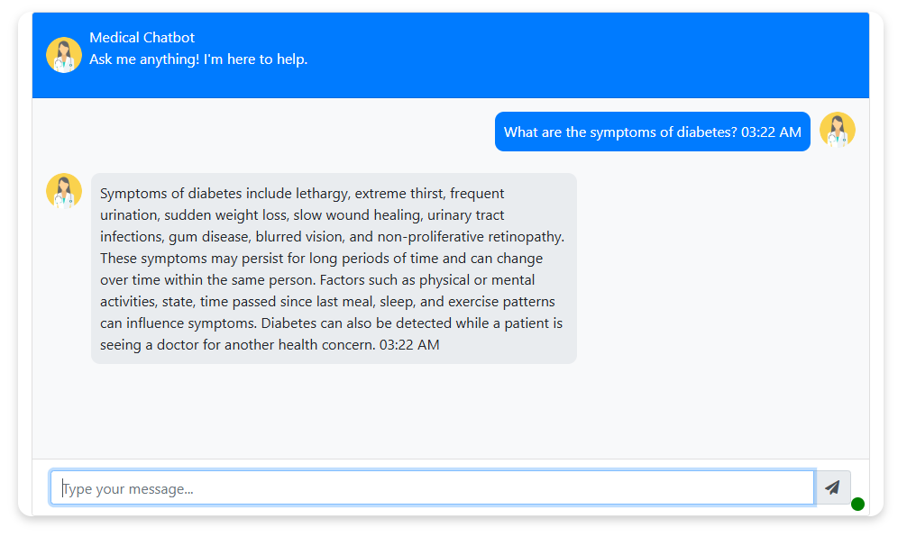

# Medical Chatbot

A conversational AI chatbot designed to assist with medical inquiries and provide general information about medical conditions, symptoms, and treatments. It utilizes state-of-the-art NLP models to deliver accurate and contextually relevant responses in real-time.

## Table of Contents
1. [Features](#features)
2. [Tech Stack](#tech-stack)
3. [Installation](#installation)
4. [Usage](#usage)
5. [How It Works](#how-it-works)
6. [Code Example](#code-example)
7. [Future Enhancements](#future-enhancements)
8. [License](#license)
9. [Acknowledgments](#acknowledgments)

## Features
- **User-Friendly Chat Interface**:
  - Modern, responsive design with support for both desktop and mobile devices.
  - Interactive typing indicator for real-time feedback.

- **Medical Knowledge Base**:
  - Answers queries related to symptoms, treatments, and medical conditions.
  - Provides first-aid tips and general health advice.

- **Advanced Search and Retrieval**:
  - Utilizes LLM-based retrieval-augmented generation (RAG) to enhance response quality.
  - Implements a vector database (Pinecone) for efficient semantic search.

- **Customizable API Integration**:
  - Integrates with OpenAI GPT for contextual responses.
  - Built with Flask for flexibility and scalability.

## Tech Stack
- **Backend**:
  - Flask: Handles API requests and chatbot logic.
  - Python: Core programming language.
  - NLP Libraries: Hugging Face Transformers, spaCy.
  - Pinecone: Vector database for semantic search.

- **Frontend**:
  - HTML5, CSS3: UI structure and styling.
  - Bootstrap 4: Responsive and modern UI components.
  - JavaScript (jQuery): Real-time interactions.

## Installation
Follow these steps to set up the chatbot locally:

1. Clone the repository:
   ```bash
   git clone <repository-url>
   cd MedicalChatbot

## Usage
1. Open the chatbot in your browser.
2. Type your medical query into the chat box.
3. Wait for the bot to respond in real time.

### Example Queries
- "What are the symptoms of diabetes?"
- "How do I treat a headache?"
- "What is Acromegaly?"





## How It Works
1. **User Input**: The user enters a query in the chat interface.
2. **Backend Processing**: Flask receives the query and processes it with the NLP model.
3. **Response Generation**: The response is generated using OpenAI GPT or a pre-trained Hugging Face model.
4. **Frontend Display**: The response is sent back to the frontend and displayed in the chat interface.

---

## Future Enhancements
- Add **voice input/output** for a hands-free experience.
- Support for **multiple languages** to expand accessibility.
- Integration with **live medical APIs** for real-time updates on drug information and health statistics.
- Add **user authentication** for personalized experiences.


## Acknowledgments
- [OpenAI](https://openai.com) for providing GPT models.
- [Hugging Face](https://huggingface.co) for NLP resources.
- [Bootstrap](https://getbootstrap.com) for modern UI components.
